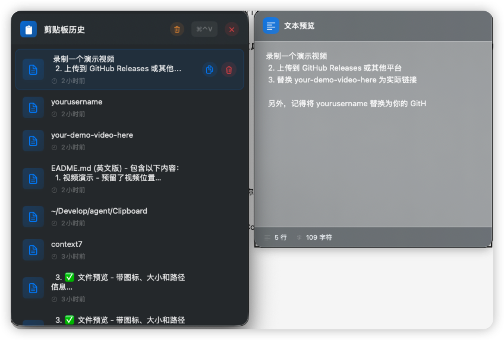

# Clipboard

一款轻量级的 macOS 剪贴板历史管理工具。通过全局快捷键快速访问所有复制过的内容。

[English](README.md)

## 应用截图



## 功能特性

- **剪贴板历史** - 自动保存剪贴板历史（支持文本、图片和文件）
- **全局快捷键** - 按 `⌃⌘V` 快速打开剪贴板管理器（可自定义）
- **模糊搜索** - 智能模糊匹配（完全匹配、首字母缩写、前缀匹配、近似匹配）
- **预览面板** - 鼠标悬停即可预览完整内容
- **多语言支持** - 支持英语和简体中文
- **图片支持** - 自动生成图片缩略图
- **文件识别** - 识别并显示文件引用

## 系统要求

- macOS 15.0 或更高版本
- 辅助功能权限（用于全局快捷键）

## 从源码构建

### 前置要求

- Xcode 16.0 或更高版本，或
- Swift 6.0+ 工具链与 Swift Package Manager

### 使用 Swift Package Manager 构建

```bash
# 克隆仓库
git clone https://github.com/hcjcch/Clipboard.git
cd Clipboard

# 构建项目
swift build

# 运行应用
swift run
```

### 使用 Xcode 构建

```bash
# 生成并打开 Xcode 项目
swift package generate-xcodeproj
open Clipboard.xcodeproj

# 或直接打开（Xcode 16+）
open Package.swift
```

然后在 Xcode 中构建并运行（Product > Run，或按 `⌘R`）。

## 首次运行

首次启动时，需要授予辅助功能权限：

1. 打开 **系统设置** > **隐私与安全性** > **辅助功能**
2. 点击锁图标进行解锁
3. 在列表中找到 "Clipboard" 并启用它

## 使用方法

- **显示/隐藏**: 按 `⌃⌘V`（Control + Command + V）
- **搜索**: 直接输入文字过滤剪贴板历史
- **选择**: 使用方向键或鼠标选择
- **复制**: 按 Enter 将选中项复制到剪贴板
- **预览**: 鼠标悬停在项目上查看完整内容
- **清空搜索**: 按 Escape
- **设置**: 点击菜单栏中的齿轮图标

## 许可证

MIT License - 详见 [LICENSE](LICENSE)。

## 贡献

欢迎贡献！请随时提交 Pull Request。
