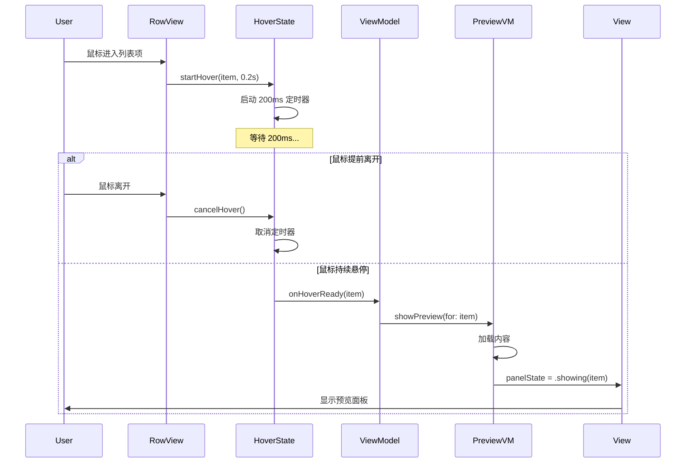
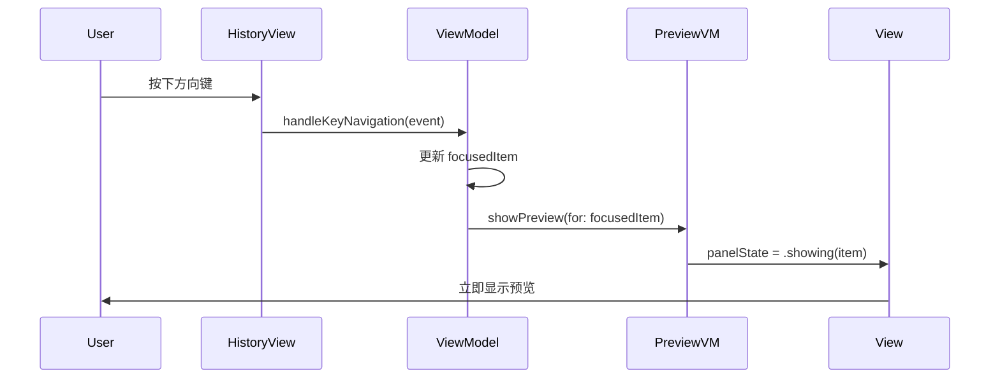

# Data Model: 剪贴板预览面板

**Feature**: 剪贴板预览面板 (001-clipboard-preview-panel)
**Date**: 2025-01-18
**Status**: ✅ Complete

## Overview

本文档定义了剪贴板预览面板功能的数据模型，包括状态枚举、视图模型和预览内容封装。设计遵循现有 MVVM 架构模式，复用现有 `ClipboardItem` 模型，最小化新增数据结构。

---

## Entities

### 1. PreviewPanelState (新增)

**Type**: Enumeration
**File**: `Clipboard/Models/PreviewPanelState.swift`

预览面板的显示状态枚举，用于控制 UI 行为。

```swift
enum PreviewPanelState: Equatable {
    case hidden                    // 预览面板隐藏
    case showing(ClipboardItem)    // 正在显示预览内容
    case loading                   // 内容加载中
    case error(String)             // 错误状态（显示错误消息）
}
```

#### State Transitions

```
[hidden] --(on hover + 200ms delay)--> [loading]
[loading] --(content ready)---------> [showing(item)]
[loading] --(load failed)-----------> [error(message)]
[showing] --(item deleted)---------> [error("该项已被删除")]
[showing] --(on exit)--------------> [hidden]
[error] --(on exit)---------------> [hidden]
```

#### Validation Rules
- `showing` 状态必须包含有效的 `ClipboardItem`
- `error` 状态的消息长度应在 1-100 字符之间
- 状态转换必须经过 ViewModel，不可直接修改

---

### 2. PreviewContent (新增)

**Type**: Struct
**File**: `Clipboard/Models/PreviewContent.swift`

封装预览内容和 UI 状态，用于视图绑定。

```swift
struct PreviewContent: Equatable {
    let item: ClipboardItem
    let displayText: AttributedString?
    let thumbnailData: Data?
    let fileInfo: FileInfo?
    let isLoading: Bool
    let errorMessage: String?

    struct FileInfo: Equatable {
        let fileName: String
        let fileType: String
        let fileCount: Int
        let fileIcon: NSImage?
    }
}
```

#### Fields

| Field | Type | Optional | Description |
|-------|------|----------|-------------|
| `item` | `ClipboardItem` | No | 原始剪贴板项数据 |
| `displayText` | `AttributedString` | Yes | 高亮显示的文本内容（仅文本类型） |
| `thumbnailData` | `Data` | Yes | 图片缩略图数据（仅图片类型） |
| `fileInfo` | `FileInfo` | Yes | 文件信息（仅文件引用类型） |
| `isLoading` | `Bool` | No | 是否正在加载内容 |
| `errorMessage` | `String` | Yes | 错误消息（如有） |

#### Computed Properties

```swift
var contentType: ClipboardItemType {
    item.type
}

var hasValidContent: Bool {
    errorMessage == nil && !isLoading
}
```

---

### 3. HoverState (新增)

**Type**: Class (Observable)
**File**: `Clipboard/Models/HoverState.swift`

跟踪鼠标悬停状态，实现延迟触发逻辑。

```swift
@Observable
class HoverState {
    var currentItem: ClipboardItem?
    var hoverStartTime: Date?
    var isHovering: Bool = false

    private var hoverTimer: Timer?

    // 开始悬停计时
    func startHover(for item: ClipboardItem, delay: TimeInterval = 0.2) {
        currentItem = item
        hoverStartTime = Date()
        isHovering = true

        hoverTimer?.invalidate()
        hoverTimer = Timer.scheduledTimer(withTimeInterval: delay, repeats: false) { [weak self] _ in
            self?.notifyHoverReady()
        }
    }

    // 取消悬停
    func cancelHover() {
        hoverTimer?.invalidate()
        hoverTimer = nil
        currentItem = nil
        hoverStartTime = nil
        isHovering = false
    }

    private func notifyHoverReady() {
        // 通过回调通知 ViewModel
        onHoverReady?(currentItem)
    }

    var onHoverReady: ((ClipboardItem?) -> Void)?
}
```

---

## ViewModels

### PreviewPanelViewModel (新增)

**Type**: Class (Observable)
**File**: `Clipboard/ViewModels/PreviewPanelViewModel.swift`

预览面板的视图模型，管理预览状态和内容加载。

```swift
@Observable
class PreviewPanelViewModel {
    // MARK: - Published State
    var panelState: PreviewPanelState = .hidden

    // MARK: - Dependencies
    private let imageStorageService: ImageStorageService
    private var cancellables = Set<AnyCancellable>()

    // MARK: - Initialization
    init(imageStorageService: ImageStorageService = .shared) {
        self.imageStorageService = imageStorageService
        setupContentObservers()
    }

    // MARK: - Public Methods
    func showPreview(for item: ClipboardItem) {
        panelState = .loading
        loadPreviewContent(for: item)
    }

    func hidePreview() {
        panelState = .hidden
    }

    func refreshPreviewContent() {
        guard case .showing(let item) = panelState else { return }
        panelState = .loading
        loadPreviewContent(for: item)
    }

    // MARK: - Private Methods
    private func loadPreviewContent(for item: ClipboardItem) {
        switch item.type {
        case .text:
            loadTextContent(item)
        case .image:
            loadImageContent(item)
        case .file:
            loadFileContent(item)
        }
    }

    private func loadTextContent(_ item: ClipboardItem) {
        // 文本内容立即可用（已在 ClipboardItem 中）
        panelState = .showing(item)
    }

    private func loadImageContent(_ item: ClipboardItem) {
        // 优先使用缩略图
        if let thumbnail = item.thumbnailData {
            panelState = .showing(item)
        } else if let imagePath = item.imagePath {
            // 异步加载原图
            imageStorageService.loadImage(at: imagePath) { [weak self] result in
                DispatchQueue.main.async {
                    switch result {
                    case .success(let data):
                        self?.panelState = .showing(item)
                    case .failure(let error):
                        self?.panelState = .error("加载图片失败: \(error.localizedDescription)")
                    }
                }
            }
        } else {
            panelState = .error("无法预览此图片")
        }
    }

    private func loadFileContent(_ item: ClipboardItem) {
        // 解析文件 URL 并提取信息
        guard let content = item.content else {
            panelState = .error("无法预览此内容")
            return
        }

        // 文件信息已在 ClipboardItem 中编码
        panelState = .showing(item)
    }

    private func setupContentObservers() {
        // 监听剪贴板项更新
        NotificationCenter.default.publisher(for: .clipboardItemDidUpdate)
            .compactMap { $0.userInfo?["itemId"] as? String }
            .sink { [weak self] itemId in
                self?.handleItemUpdate(itemId: itemId)
            }
            .store(in: &cancellables)

        // 监听剪贴板项删除
        NotificationCenter.default.publisher(for: .clipboardItemDidDelete)
            .compactMap { $0.userInfo?["itemId"] as? String }
            .sink { [weak self] itemId in
                self?.handleItemDelete(itemId: itemId)
            }
            .store(in: &cancellables)
    }

    private func handleItemUpdate(itemId: String) {
        guard case .showing(let item) = panelState,
              item.id == itemId else { return }
        refreshPreviewContent()
    }

    private func handleItemDelete(itemId: String) {
        guard case .showing(let item) = panelState,
              item.id == itemId else { return }
        panelState = .error("该项已被删除")
    }
}
```

---

## ClipboardHistoryViewModel (扩展)

**File**: `Clipboard/ViewModels/ClipboardHistoryViewModel.swift`

扩展现有的剪贴板历史视图模型，添加预览状态管理。

```swift
extension ClipboardHistoryViewModel {
    // MARK: - Preview State
    var hoveredItem: ClipboardItem? {
        get { hoverState.currentItem }
        set { hoverState.currentItem = newValue }
    }

    var shouldShowPreview: Bool {
        if case .showing = previewPanelViewModel.panelState {
            return true
        }
        return false
    }

    // MARK: - Hover Handlers
    func onItemHovered(_ item: ClipboardItem) {
        hoverState.startHover(for: item, delay: 0.2)
    }

    func onItemExited() {
        hoverState.cancelHover()
        previewPanelViewModel.hidePreview()
    }

    func onItemFocused(_ item: ClipboardItem) {
        // 键盘导航时立即显示预览（无延迟）
        previewPanelViewModel.showPreview(for: item)
    }
}
```

---

## Relationships

```mermaid
erDiagram
    ClipboardItem ||--o{ PreviewContent : encapsulates
    PreviewPanelState }|--|| ClipboardItem : contains
    PreviewPanelViewModel ||--|| PreviewPanelState : manages
    PreviewPanelViewModel ||--|| ImageStorageService : uses
    ClipboardHistoryViewModel ||--|| PreviewPanelViewModel : coordinates
    ClipboardHistoryViewModel ||--|| HoverState : tracks
    HoverState ||--o|| ClipboardItem : references
```

---

## Data Flow

### Mouse Hover Flow



### Keyboard Navigation Flow



---

## Validation Rules Summary

| Entity | Rule | Enforced By |
|--------|------|-------------|
| `PreviewPanelState` | 状态必须通过 ViewModel 转换 | Access control (private setter) |
| `PreviewContent` | `item` 不可为 nil | Type system (non-optional) |
| `HoverState` | 悬停时间必须 ≥ 200ms | Parameter default + validation |
| `PreviewPanelViewModel` | 所有 UI 更新必须在主线程 | DispatchQueue.main.async |

---

## Performance Considerations

1. **State Updates**: 使用 `@Observable` 代替 `@Published`，减少 Combine 管道开销
2. **Image Loading**: 缩略图优先，原图按需加载，避免阻塞 UI
3. **Debouncing**: 快速切换时 150ms 去抖动，减少无效渲染
4. **Memory Management**: 使用 `[weak self]` 避免循环引用，定时器自动取消

---

## Next Steps

Phase 1 数据模型设计完成：
- ✅ 所有数据实体已定义
- ✅ 视图模型接口已明确
- ✅ 数据流和状态转换已设计
- ✅ 可继续生成组件契约（`contracts/`）
